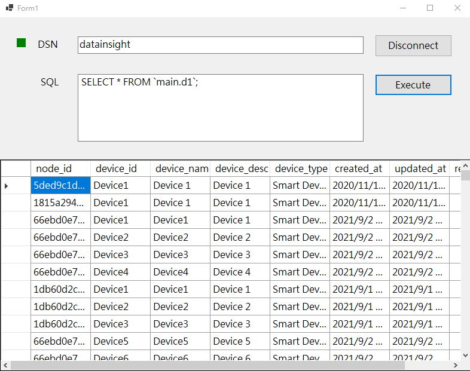

# DataInsight-ODBC-DotNet-Sample

## Environment

* IDE
	* Visual Studio 2022 and above
* Runtime
	* .Net 6.0
* Dependency Package
	* [System.Data.Odbc](https://www.nuget.org/packages/System.Data.Odbc/)

## How to use
* Follow [Technical document](https://docs.wise-paas.advantech.com/preview/zh-tw/Guides_and_API_References/ApplicationServices/1647311791052238313/1680144365392639116) to set ODBC connection setting first. 

* After entering the ODBC DSN set up in the previous step, click the "Connect" button. 
* Once the green light is on, execute the SQL query to be queried.

